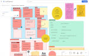

# Selenium Showcase

[](http://13.60.226.17:8080/job/selenium-maven/)  [This build badge is set automatically by my Jenkins server. The CI/CD pipeline is triggered with every commit to this repo. When I'm rich and famous, I'm going to buy an elastic ip address so this doesn't keep breaking :-)]

## Introduction
I've been learning Selenium and JavaSE and wanted to both deepen my understanding and showcase what I've learned by writing a test automation project for which the system under test was humanlegion.com, my own publishing website. It's been a lot of fun to write. In fact, it still is, as I'm actively extending this.

## Some highlights:

### Page object model
Inside the Junit classes, I keep the tests clean and precise so that the intent of the tests is always clear. Assertions live inside the junit classes and nowhere else. The implementation of the tests is abstracted away to the page objects.

### Element abstraction layer 
The system under test has some complex elements or test requirements, such as book tabs, YouTube video player, and the need to verify Amazon sales links are live and my books are on sale. Where appropriate, these are abstracted into packages of the element abstraction layer. The Junit tests have little or no direct interaction with these element objects because that is handled at the page object level.

### Command-line driven
Tests can be run from the command line using Maven/ Surefire and I've added my own comand line options to communicate to the TestSession object such things as which webdriver to use. In my previous project, I found it very useful to be able to initiate not just the tests but set the test configuration from the command line, so we could easily do such things as drive regression and smoke testing across multiple test configurations from bash scripts.

### Driver abstraction
I use a TestSession class that, amongst other things, handles the selection of driver and driver options, using defaults, coded parameters, or command-line parameters as appropriate.

### OOP design 
Constructor overloading, abstract page class, encapsulation, abstraction, separation of concerns.

### CI/CD pipeline [added in phase 2]
I've implemented a simple CI/CD pipeline. Commits to the GitHub trunk trigger a webhook that posts to an API endpoint on my Jenkins server, initiating a new Jenkins build that recompiles and runs all the Selenium tests and emails me if tests fail. The Jenkins script is itself stored in the same GitHub repo, and it does most of its work by shelling out to Bash scripts and Windows batch files to make use of the o/s commands and to invoke various Maven goals and phases.

The CD part of the CI/CD is trivial for this project, but if I added an 'mvn deploy' shell command to the script, then we would jar up the classes, deploy to the Maven repository, deploy to the deployment test environment (just a local folder), and run (trivial) integration tests, just to illustrate how we can slot all these things into the pipeline to work according to our needs.

I've implemented Jenkins pipelines as a local Window service, on my AWS EC2 Ubuntu server, and in Docker Desktop for Windows. Docker's great – no need for all that configuration, just grab the image and go – but the WSL 2 subsystem overwhelmed my system drive and so it had to go (for now... Docker will return). 

Next steps with Jenkins: reconfigure WSL 2 and try again, run Docker in Linux, and add another command line option to my Maven test invocation to tell it to run Selenium tests in headless mode, which I need so I can run the tests automatically on Linux but default to showing the UI for environments where that is appropriate.

### Agile with Jira and Confluence [added in phase 2]
There's a team size of one, but I still need to plan all my work and pull active tasks from my backlog. For this, I manage my work using a Kanban board I've implemented in Jira. So far, I haven't felt any need to customize the default issue types, even though I'm freely mixing many kinds of tasks, including:
- Bugs in my Selenium test code, Jenkins scripts etc.
- Enhancements to my code or server pipelines
- Skills learning.
- CV updates and job applications

[](Documentation/Resources/Phase2_Kanban_Jira.jpg)
[My Kanban board: click thumbnail to expand]

When I'm ready, I make Jira releases that match the GitHub repo releases.
Then I return to my Confluence documentation spaces, and especially my planning whiteboad, to consider backlog updates for the next phases.

[](Documentation/Resources/Phase2_Planning_Whiteboard_Confluence.jpg)
[My Confluence planning white board: click thumbnail to expand]

## How to use
The folder structure mostly follows the Maven standard. 
- Test code in general is: src\test\java\com\humanlegion\pagetests
- Element abstraction layer: src\test\java\com\humanlegion\elementabstractionlayer
- Page object model classes: src\test\java\com\humanlegion\pageobjectmodel
- Test Session class and other helper classes: src\test\java\com\humanlegion\utils
- There's not a lot of interest at the moment in the following folders, but there will be soon: src\main\java\com\humanlegion\ and src\test\java\com\humanlegion\integrationtests

Obviously, we can launch tests from the IDE, but we can also run tests from the command line using the Maven Surefire plugin, or run them through other tools, such as the CI/CD pipeline I have running on Jenkins (though with my simple Jenkins setup -- a single built-in node on my AWS EC2 linux server -- we need to run Selenium tests in headless mode if we don't want to crash the Edge driver).

For example, to run all Selenium tests in the TestSystemUnitTests class with the Microsoft Edge driver:

```
mvn -Ddriver=EDGE  -Dtest=TestSystemUnitTests test
```

To get a concise output when running all tests, I like to do:
```
mvn -Ddriver=CHROME test | findstr /C:"Running " /C:"Tests run

```

But I'm running Windows. If I were on Unix, I guess that would be

```
mvn -Ddriver=CHROME test | grep -E "Running |Tests run"
```

### So, are these unit tests?

Test classification at a conceptual level is very useful, but it can get confusing when you get down into the reeds of practical details. Our project is written using Maven, a plugin pipeline tool that uses convention to subtly encourage its users through a standard production lifecycle (though is actually extremely configurable). 

I decided to follow standard Maven convention, which means I'm running the Selenium tests of the website in the Maven test phase, by which Maven means *unit tests*. While there are a few unit tests of the test code itself, the tests of the website are system tests. If they were unit tests, then there would be a tight mapping between the tests in src/tests/java and classes being tested in src/main/java.

The JUnit Selenium tests are being run through the Maven Surefire plugin. 
I've also written integration tests that I run through the Maven Failsafe plugin, which is almost the same as Surefire with the exception that Surefire will abort the build lifecycle if tests fail, but Failsafe will continue so that it guarantees to run its post-test teardown phase.

The integration tests in my case are pretty meaningless except, possibly, to hardcore Bob the Builder fans. The tests are just an example of how we can slot the tests we need into the points we need them in the CI/CD pipeline.
The lifecycle and the tools used are highly configurable and ultimately, between a Jenkins pipeline script that can shell out run any batch file or Bash script, and the pom.xml file that drives Maven, we have a lot of scope for automatically defining our own test approach, with pre- and post- steps for setup and teardown.

For what it's worth, we can run just the integration tests like this (but only because there is no pre- and post- setup stage in my case):
```
mvn clean test-compile failsafe:integration-test
```
And we can invoke the entire Maven default lifecycle by specifying the final phase in the lifecycle, which causes all the previous ones to run. The integration, deployment, and installation phases all do a little something, though mostly using the package build from src/main/java rather than anything to do with humanlegion.com :
```
mvn deploy
```


> [!NOTE]
> **You can pick any Selenium driver you like... so long as it's Chrome or Edge.**
> Yeah, about that. The code's in the TestSession class to handle all the drivers, but it's commented out other than for Chrome and Edge. The reason is simply that I don't have enough space on my main drive to download any more drivers.
> Seriously. I've put the drivers themselves on my D: drive and changed the Maven setting.xml to put everything I can onto D:, but the footprint on C: is still high. Maybe it's time I bought a new computer?


